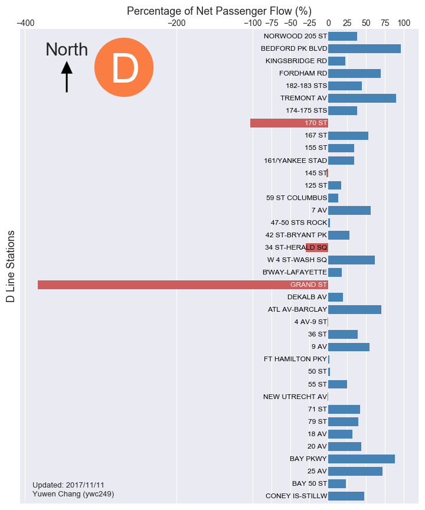

## Homework review for:
__PUI2017_ywc249/HW8_ywc249/README.md__

Plot discussed:

__CLARITY: is the plot easy to read? is it clear or confusing, are the quantities being visualized ambiguous?__

- The plot is initially easy to read but upon a closer look it does get confusing. The confusion leads to the question what is the 100%, quantities should be adding to 100 and it is not very clear what that is. 
- On the Figure caption there are few bullet points which cover some of the questions, including the calculation, however the formula does not render properly. 

__ESTHETIC: beautiful is a subjective judgment: you should not judge the plot on the basis of whether you think it is "beautiful", but you should judge whether its esthetic is functional to what it is meant to communicate. Are the colors chosen appropriately? Are the graphical elements used appropriate to represent the quantities being visualized? Are the graphical choices allowing you to focus on the right elements or are they distracting you?__

- The graph is very well presented. The colors are easy to understand, it has positives to the right, and negatives to the left, which is a logical association. 
- At a high level it is very easy to see which are the stations on which more people enter and exit, it follows common sense and the outlier is very easy to see and to comprehend. 

__HONESTY: is the plot honestly reproducing the data or is it deforming it, perhaps to emphasize a point?__

- The plot is honestly reproducing the observed data. However, back to the clarity point, it is not clear from the plot itself what represents "a whole", in other words, what would represent a 100% .  
- The intention is clear, to visually highlight the stations that have more entries (or exits). 

__SUGGESTED IMPROVEMENTS:__

- My main feedback would be to consider the receiver of the plot it will be an external entity who may not think the same way as we do, so what is clear to us will be clear for everyone may be a dangerous assumption.  The concept was there, the esthetic is good, and working a little more on the clarity would improve significantly the over all quality of the plot and the brief study. 

Additionally: there was too much information with the same level of importance in the "caption" section. Not all of these statements served the same purpose, and could've been presented separately for added clarity.

BR,
Valeria
