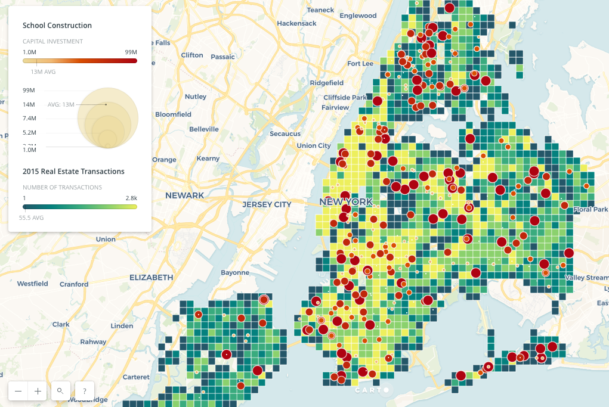

# Peer Review of HW8 by Davey Ives

## Reviewer: Yuwen Chang (ywc249)

## Comments

### Clarity

- The plot seems messy at first sight and take some time to understand. But the variable lables are helpful in explaining the plot.

- It is not clear which is the critical information: real estate transactions v. number of school constructions or the investment amount or both.

[Recommendation]

- Just a tiny adjustment, for school construction, it would be even better to make the label clearer: does each point represent a site? is it under constructing or only those began? in 2015?

### Aesthetic

- The red-green color pair is a good choice that it separates two variables clearly. Contrasting (light-dark) both color bars is also a good way to distinguish high-low values for each variable.

- Using both circle size and color bar for school construction strenghtens the information to be conveyed.

[Recommendation]

- Grids may not be very meaningful in this case. Try removing gridlines, applying gradient colors or adopting heat maps to avoid noisy information caused by solid grids.

### Honesty

- The range of capital investment is wide, but the variance in red color and circle size seems limited, and may not be representative on the larger end.

[Recommendation]

- If it is just the setting, allow more variances/levels in color gradience or circle size in school construction. If it is the outlier, consider removing it or adjust the color intervals so that lower values can have more differentiation.