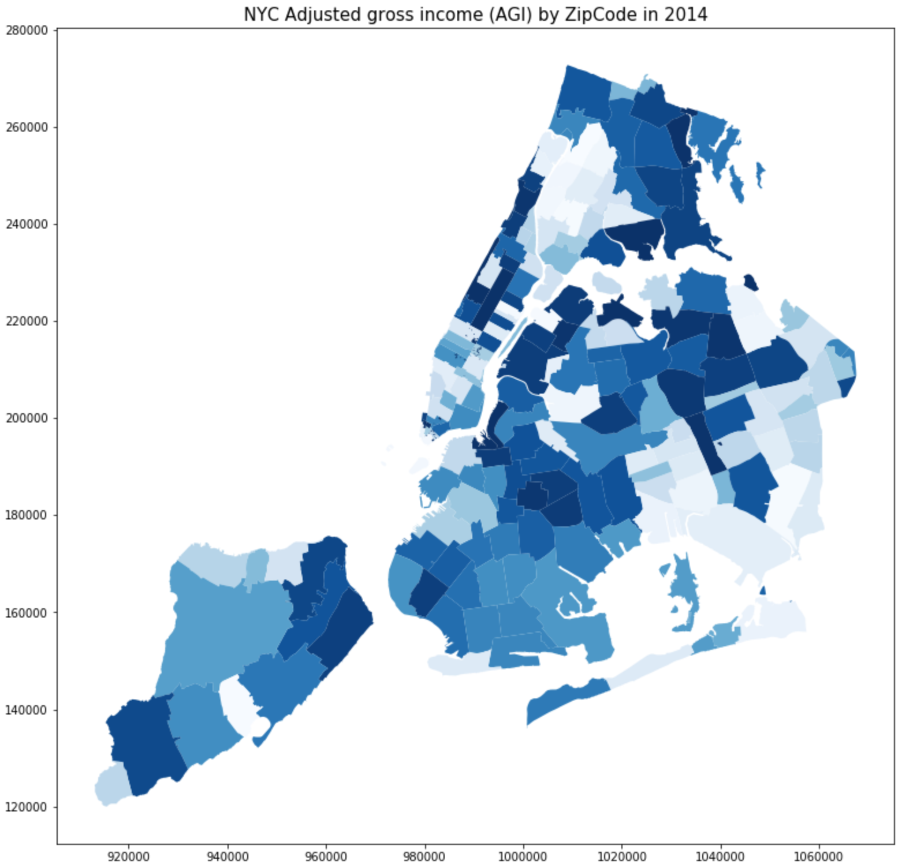

# Peer Review of HW8 by Hao Xi

## Reviewer: Yuwen Chang (ywc249)

## Comments

### Clarity

- Given the simplicity of the plot, it is not difficult to understand the core idea to be expressed.

[Recommendation]

- It would be great to include a legend for the color bar, so readers get an idea of the gap between the darkest and brightest values.

### Aesthetic

- Good choice of a single color tone, differentiated by different brightness. This avoids unnecessary confusions, and focuses on a single information/variable.

[Recommendation]

- Other than the color legend, the title can also be make bigger. Otherwise, good job.

### Honesty

- Given that Bronx has lighter colors, I suppose that darker color has higher income. Some colorings on the map appear suspicious, such as extremely high income in Central Park, extremely low incomes in lower Manhattan, and highly heterogenous/dissimilar incomes in Upper Town.

[Recommendation]

- Perhaps an examination has to be done to make sure the coloring is representing what it should convey.