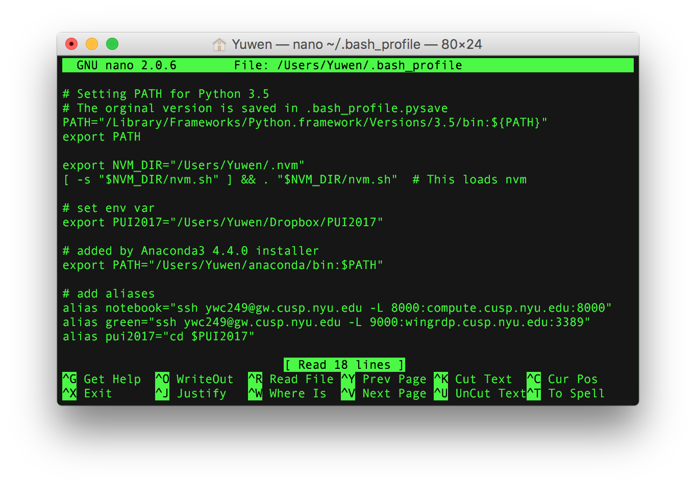

# PUI2017 HW 1-2

## Set up the environment
I added one line for setting the environmental variable and another line creating an alias with the `cd` command that directs to the path:

```
export PUI2017="Users/Yuwen/Dropbox/PUI2017"
alias pui2017="cd $PUI2017"
```



## Check if things work
Then I used `pwd` command to see if the alias `pui2017` works as expected.
